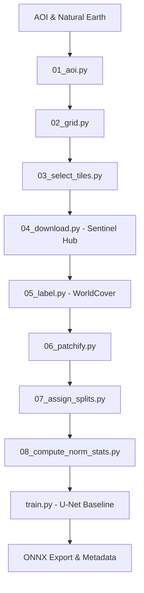

# Project Context & AI Interaction Rules

This document summarizes the current state of the **GFM Landcover Mapping** project and provides specific instructions for subsequent AI interactions to ensure consistency, quality, and progress.

## 🚀 Project Mission
Investigate if Geospatial Foundation Models (GFMs) significantly improve accuracy and label efficiency in land-cover mapping compared to scratch-trained baselines (U-Net).

---

## 🛠 Tech Stack & Workspace Invariants
- **Dependencies**: Managed via `pixi`. Always run commands using `pixi run` or `pixi run -e dev`.
- **Data Versioning**: Managed via `DVC`. Data preparation pipeline is defined in `dvc.yaml`.
- **Core Framework**: PyTorch Lightning for training orchestration.
- **Code Quality**: `ruff` and `mypy` are enforced via `pre-commit`.
- **Hardware**: Development supports `osx-arm64` (MPS) and `linux-64` (CUDA).

---

## 📂 System Architecture


---

## 📋 Interaction Rules for Antigravity

### 1. The "Zero Lint" Policy
- Before completing any task involving code changes, **must** run:
  ```bash
  pixi run -e dev lint-all
  ```
- **Git Awareness**: `pre-commit` hooks are configured to track **staged files**. While `lint-all` runs on all files via `--all-files`, verify that changes are staged if running hooks individually or when committing.
- All linter errors (ruff) and type errors (mypy) must be resolved.

### 2. Data Contract Adherence
- Respect the **Training Data Contract** in `README.md`.
- Never modify the split assignment in `dataset_index_with_split.csv` during training.
- OOD data is **strictly read-only** for testing and must never influence normalization or early stopping.

### 3. Workflow Patterns
- **Logging**: Use `logging.getLogger(__name__)`. No `print` statements in library code (`landcover/`) or pipeline scripts.
- **Config**: All hyperparameters and paths should be derived from `conf/params.yaml`.
- **DVC**: Any change to data processing logic must be accompanied by an update/check of `dvc.yaml`.

---

## 📈 Recent Progress & Current Frontier
- **Done**: Robust multi-stage DVC pipeline, IID/OOD country-stratified splitting, OOP-based sampling strategies, U-Net baseline orchestration, and ONNX export with normalization metadata.
- **Current Focus**: Ensuring training runs reliably on available hardware and validating export artifacts.
- **Future Tasks**:
    1. Implementing NASA Prithvi GFM fine-tuning.
    2. Developing comprehensive per-country and per-class evaluation metrics.
    3. Building an inference pipeline/service for the exported models.

---

## 💡 Pro-tip for Next Session
When starting a new task, first verify the environment:
```bash
pixi run -e dev python -c "import torch; print(f'Torch: {torch.__version__}, MPS: {torch.backends.mps.is_available()}')"
```
Check pipeline status:
```bash
pixi run -e dev dvc status
```
